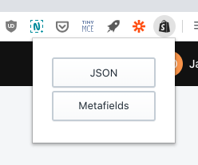

Shopify Meta JSON
===============

> Easily view the JSON for Products, variants, and metafields

### Features

- [x] View product JSON
- [x] View product metafield JSON
- [x] View variant JSON
- [x] View variant metafield JSON
- [ ] Bonus: Link to section editor

### Installation

**TODO**

### Development

1. Clone the project
2. Open [chrome://extensions/](chrome://extensions/)
3. Click "Load unpacked"
4. Navigate to the root of the cloned folder
5. Click "Select"
6. Work away!
